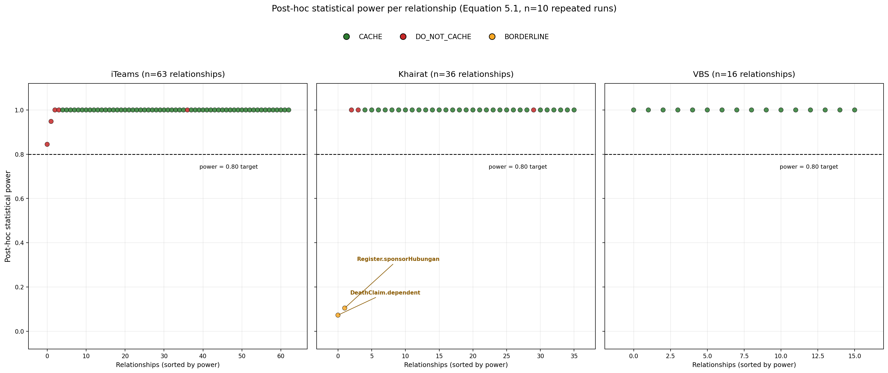
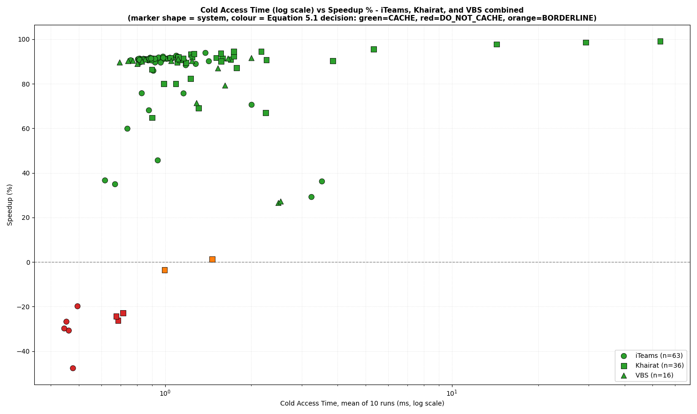

# A Decision Model for Determining What to Cache in ORM-Based Database Applications

[](https://doi.org/10.5281/zenodo.21505973)


Reproducibility artifact for the PhD research of **Shahril bin Mohd Isa**, Fakulti Teknologi Maklumat dan Komunikasi (FTMK), Universiti Teknikal Malaysia Melaka (UTeM), supervised by Assoc. Prof. Ts. Dr. Nurul Akmar Emran.

This repository contains the raw empirical data, benchmark harness code, and an independent analysis script supporting the thesis/proposal *"A Decision Model for Determining What to Cache in ORM-Based Database Applications: Balancing Performance and Resource Cost."*

## What this research is about

Object-Relational Mapping (ORM) frameworks such as Laravel's Eloquent hide the true performance cost of a data-access operation behind simple object syntax (e.g. `$model->relatedItems`). This makes it hard for developers to know, in advance, which ORM relationships are worth caching and which are not — caching the wrong ones can *degrade* performance rather than improve it.

This research proposes and empirically validates a **decision rule** (Equation 5.1: a one-sample t-test applied to repeated per-relationship speedup measurements) that classifies each ORM relationship as `CACHE`, `DO_NOT_CACHE`, or `BORDERLINE`, based purely on repeated, controlled measurement — no machine learning involved.

The rule is validated against three independently operated, production Laravel/Eloquent systems:

| System | Description | Users | Relationships benchmarked |
|---|---|---|---|
| **iTeams** | ICT and network task-management system (JPNM) | ~100 | 63 |
| **Khairat Kematian** | Community death-benefit fund management system | <300 members | 36 |
| **VBS** (Vehicle Booking System) | Transport-booking management system (JPNM) | ~200 | 16 |

## Repository structure

```
.
├── code/                          Benchmark harness (PHP artisan command) per system
│   ├── iTeams/
│   │   ├── BenchmarkCaching.php
│   │   └── relationships_for_benchmark.csv
│   ├── Khairat/
│   │   ├── BenchmarkCaching.php
│   │   └── relationships_for_benchmark_khairat.csv
│   └── VBS/
│       ├── BenchmarkCaching_vbs.php
│       └── relationships_for_benchmark_vbs.csv
├── data/
│   ├── iTeams/                    10 repeated benchmark runs + aggregated results (CSV)
│   │   └── rerun/                 10 replication runs (v1.3.0)
│   ├── Khairat/                   10 repeated benchmark runs + aggregated results (CSV)
│   │   └── rerun/                 10 replication runs (v1.3.0)
│   ├── VBS/                       10 repeated benchmark runs + aggregated results (CSV)
│   │   └── rerun/                 10 replication runs (v1.3.0)
│   └── relationship_inventories/  Static relationship inventory per system (CSV)
├── analysis/
│   ├── decision_rule.py           Independent Python re-implementation of Equation 5.1
│   ├── compare_replication.py     Original vs replication agreement (v1.3.0)
│   ├── power_analysis.py          Post-hoc statistical power per relationship (G*Power-equivalent)
│   ├── plot_power_analysis.py     Generates figures/power_analysis_chart.png (Figure 5.1 in the thesis)
│   └── plot_speedup_charts.py     Generates the cold-time vs speedup scatter charts below
├── figures/
│   ├── power_analysis_chart.png   Power-per-relationship chart, colour-coded by decision
│   ├── speedup_chart_iteams.png   Cold access time vs speedup, iTeams (n=63)
│   ├── speedup_chart_khairat.png  Cold access time vs speedup, Khairat Kematian (n=36)
│   ├── speedup_chart_vbs.png      Cold access time vs speedup, VBS (n=16)
│   └── speedup_chart_combined.png All three systems combined, one chart
├── LICENSE
├── CITATION.cff
├── .gitignore
└── README.md
```

## How the data was collected

For each system, every Eloquent relationship (`belongsTo`, `hasOne`, `hasMany`, `belongsToMany`) was benchmarked on an isolated test clone (never on the live production system) using the harness in `code/<System>/`:

1. **Cold access** — a fresh model instance resolves the relationship with no cache, timed and query-counted.
2. **Cache write** — the result is written to Redis via `Cache::remember`.
3. **Warm access** — the same relationship is resolved again, now served from Redis (cache hit), timed and query-counted.

This cold/warm/write cycle was repeated for a random sample of parent records per relationship, and the entire benchmark was run **10 independent times per system** (`data/<System>/benchmark_run_*.csv`) to support repeated-measures statistical testing rather than relying on a single-run snapshot.

Data dictionary for `benchmark_run_*.csv`:

| Column | Meaning |
|---|---|
| `model`, `method`, `type` | The Eloquent relationship being benchmarked (e.g. `Unit`, `pkg`, `belongsTo`) |
| `samples` | Number of parent records sampled |
| `avg_cold_ms` / `avg_warm_ms` | Mean access time (ms) without / with caching |
| `speedup_pct` | Percentage speedup from caching: `(cold - warm) / cold * 100` |
| `avg_query_count_cold` / `avg_query_count_warm` | Mean DB query count without / with caching |
| `avg_cache_write_overhead_ms` | Mean time to write the result to Redis |

## Reproducing the decision rule independently

The thesis computes Equation 5.1 (t-statistic, p-value, formal `CACHE`/`DO_NOT_CACHE`/`BORDERLINE` decision) as live Excel formulas inside the `*_Phase2_Aggregated_Analysis.xlsx` workbooks (not included here — see the main thesis document set). `analysis/decision_rule.py` re-implements the same one-sample t-test independently in Python, so the result can be verified without opening Excel:

```bash
pip install scipy   # optional but recommended for exact p-values
python3 analysis/decision_rule.py data/iTeams
python3 analysis/decision_rule.py data/Khairat
python3 analysis/decision_rule.py data/VBS
```

This has been verified to reproduce the thesis-cited figures exactly, e.g. for iTeams' `Unit.pkg` relationship: **t = -3.557, p = 0.0031, DO_NOT_CACHE** — matching Chapter 5, Table 5.1 of the thesis to 4 decimal places.

## Post-hoc statistical power analysis

`analysis/power_analysis.py` computes post-hoc statistical power for each relationship's
Equation 5.1 t-test (n = 10 repeated runs), using the same one-sample t-test power
calculation as G*Power ("t tests — Means: difference from constant, one sample case"):

```bash
pip install statsmodels scipy
python3 analysis/power_analysis.py data/iTeams
python3 analysis/power_analysis.py data/Khairat
python3 analysis/power_analysis.py data/VBS
```

**Finding:** all 63 iTeams relationships and all 16 VBS relationships achieved >= 0.80
power at n=10 given their observed effect size. In Khairat, all `CACHE`/`DO_NOT_CACHE`
decisions were well-powered (power >= 0.99 in every case), and the only two relationships
below the 0.80 power target — `DeathClaim.dependent` and `Register.sponsorHubungan` — are
exactly the two relationships the decision rule already classifies as `BORDERLINE`. This
supports treating `BORDERLINE` as a genuinely inconclusive result driven by a small true
effect size relative to n=10, rather than a weakness of the decision rule itself.



*Figure: Post-hoc statistical power per relationship, sorted within each system. Green = CACHE,
red = DO_NOT_CACHE, orange = BORDERLINE. Regenerate with `python3 analysis/plot_power_analysis.py`.*

## Cold access time vs speedup charts

`analysis/plot_speedup_charts.py` regenerates the cold-access-time-vs-speedup scatter charts
(the same charts shown in Chapter 4 of the thesis and inside the `*_Phase2_Aggregated_Analysis.xlsx`
workbooks) directly from the raw CSVs in `data/`, using the exact same Equation 5.1 decision
rule as `decision_rule.py` to colour each point:

```bash
pip install matplotlib scipy
python3 analysis/plot_speedup_charts.py                  # writes all 4 charts to figures/
python3 analysis/plot_speedup_charts.py --system iTeams   # regenerate just one system
```



*Figure: Cold access time (log scale) vs caching speedup, all three systems combined. Marker
shape = system, colour = Equation 5.1 decision (green = CACHE, red = DO_NOT_CACHE,
orange = BORDERLINE). Per-system versions are in `figures/speedup_chart_<system>.png`.*

## Key finding

A relationship's own cold (uncached) access time, measured empirically and analysed through repeated-measures statistical testing, provides a reliable, system-specific basis for the caching decision. The decision-making *process* generalises across all three independently operated systems even where the underlying numeric measurements (and, in VBS's case, even the direction of the cold-time/speedup correlation) do not transfer directly between them — see the thesis, Chapter 5.6, for the full discussion of this generalisability boundary.

## Replication campaign (v1.3.0)

The original measurement campaign ran on 19-20 July 2026. To test whether the reported
classification reflects a property of the relationships or the particular conditions of a
single campaign, the complete procedure was re-executed from scratch on all three systems
ten days later, ten runs of 30 samples each.

This is not a controlled experiment isolating one factor. Several conditions varied at once
and none was held fixed by design: elapsed time, incidental server load, database contents,
and the parent-record identifiers drawn by random sampling. Only the procedure, the
benchmarking command, and the relationship inventories were held constant. One condition was
tightened rather than varied: the language interpreter was pinned to the version serving each
site (PHP 8.2 iTeams, 8.3 Khairat Kematian, 8.1 VBS), which the original campaign did not
record in its output.

Reproduce with:

```bash
python3 analysis/compare_replication.py
```

Result:

| System | Relationships | Agreement | Mean cold access (ms) |
|---|---|---|---|
| iTeams | 63 | 63/63 (100%) | 0.993 -> 2.824 |
| Khairat Kematian | 36 | 34/36 (94.4%) | 4.094 -> 2.559 |
| VBS | 16 | 16/16 (100%) | 1.327 -> 2.401 |
| **Total** | **115** | **113/115 (98.3%)** | |

All eight DO_NOT_CACHE relationships reproduced, and all CACHE relationships reproduced,
while mean cold access time shifted by between -38% and +184%. The only two classifications
that changed were exactly the two the decision rule had returned as BORDERLINE, and they
resolved in opposite directions: `DeathClaim.dependent` to CACHE (+1.27% -> +10.45%,
p = 0.0045) and `Register.sponsorHubungan` to DO_NOT_CACHE (-3.55% -> -25.64%, p < 0.0001).
Had the rule been forced to commit on those two, it would have been wrong on one of them.

## Citation

If you use this data or code, please cite the thesis (see `CITATION.cff`).

## License

- **Code** (`code/`, `analysis/`): MIT License — see `LICENSE`.
- **Data** (`data/`): released under CC-BY-4.0 — attribution required, reuse permitted.

## Contact

Shahril bin Mohd Isa — shahril3421@gmail.com
Corresponding supervisor: Assoc. Prof. Ts. Dr. Nurul Akmar Emran — nurulakmar@utem.edu.my
